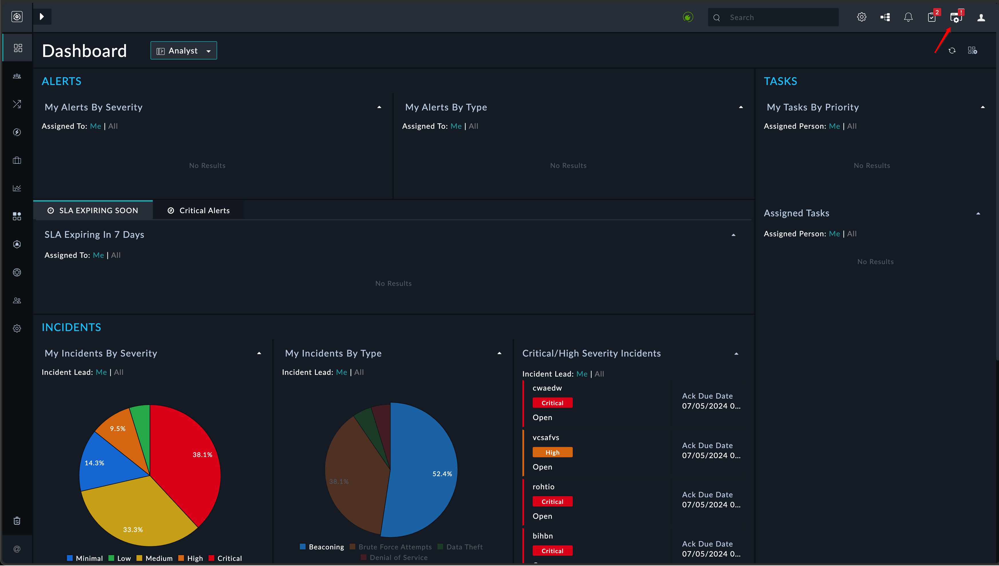
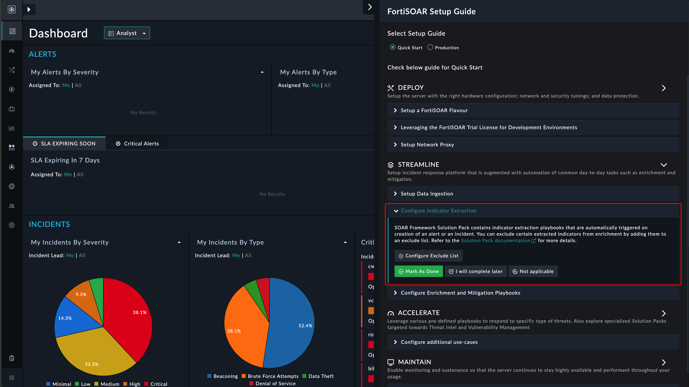
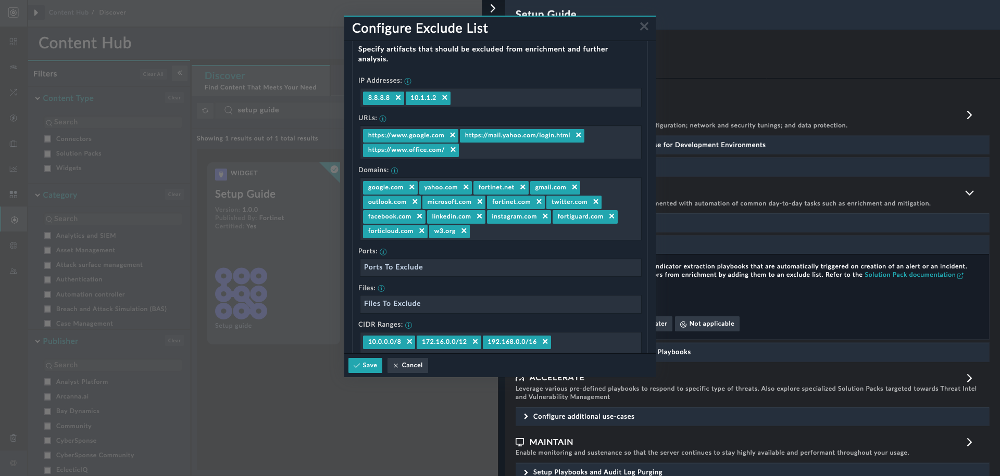

| [Home](../README.md) |
|--------------------------------------------|

# Usage

The Configure Indicator Extraction wizard helps you configure indicators to be excluded during the IOC (Indicator of Compromise) extraction process within your FortiSOAR environment. In this wizard, you can add one or multiple IOCs specific to your organization.

## Features

### Launch Configuration Wizard
- Launch **Setup Guide**
  
  
- Locate **Deploy** section

  
- Click on **Configure** button under **Configure Indicator Extraction** section

### Edit Configuration Settings
- User can review default configuration values and make edits as per the requirement
- Click **Save** button to make setting persistant

>**Note** By default, all these fields are loaded from the record labeled as `sfsp-extraction-*` within the Key Store Module.
