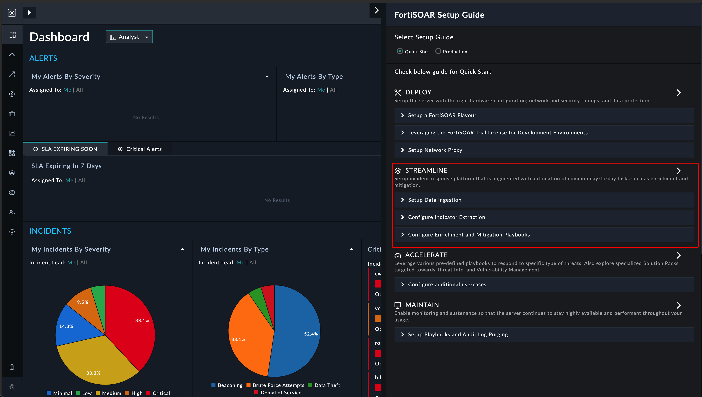
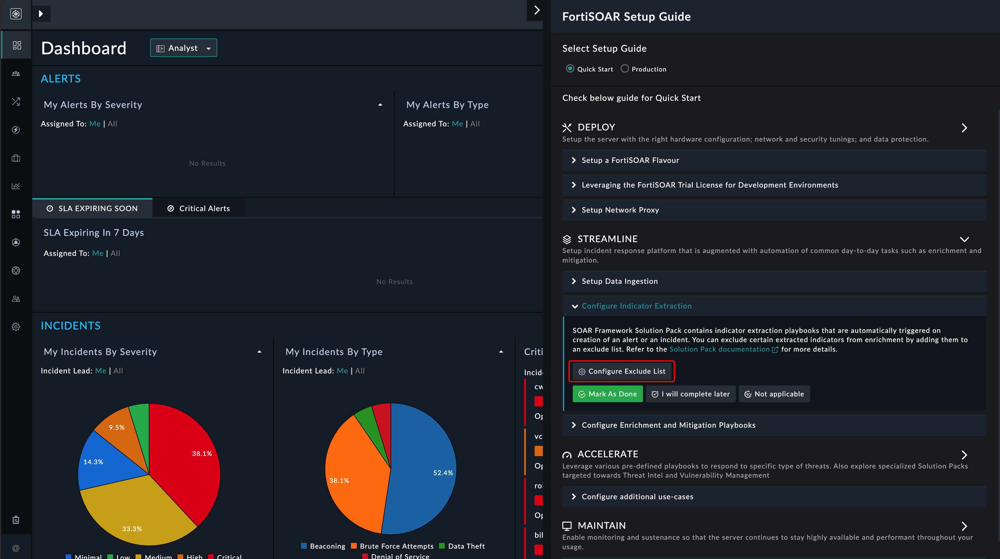

| [Home](../README.md) |
|--------------------------------------------|

# Usage

You can exclude indicators from the extraction process within your FortiSOAR environment by running the **Configure Indicator Extraction** wizard.

Following indicator types are available for you to review and edit:

- IP Addresses
- URLs
- Domains
- Ports
- Files
- CIDR Ranges

## Launch Configuration Wizard

The **Configure Indicator Extraction** widget is available under the Setup Guide  Streamline  Configure Indicator Extraction.

1. Launch **Setup Guide**.
  
    
  
2. Click to expand the **Streamline** section.

    
  
3. Click to expand the **Configure Indicator Extraction** section.
  
    

4. Click on **Configure Exclude List** button under **Configure Indicator Extraction** section

    

## Edit Configuration Settings

1. Review configuration settings and make edits as required. To add an indicator as a colored pill, enter the indicator value and press `Enter` or `Tab` on the keyboard.

    

2. Click **Save** to apply and save the changes.

<table>
    <tr>
        <th>NOTE</th>
        <td>By default, all these fields are loaded from the <strong><em>Key Store</em></strong> records starting with <code>sfsp-extraction-</code>.</td>
    </tr>
</table>
